# 🐳 Learning Docker

This project is about learning **Docker** — a tool that helps you run apps inside **containers** so they work the same everywhere.

---

## 🚀 What is Docker?

Docker lets you package your app with everything it needs (code, libraries, system tools) and run it easily on any computer.

---

## 💡 Why Learn Docker?

- No more “it works on my machine” problems  
- Easy to set up and share apps  
- Great for testing and deployment  

---

## 🧱 Basic Commands

```bash
# Check Docker version
docker --version

# Run a test container
docker run hello-world

# See running containers
docker ps

# See all containers active | no active
docker ps -a

#Command take a image as base and create a container
docker run + imageName

#Execute container in second plane
docker run + imageName -d

#Mapped ports between containers and ports 
docker run + imageName -p

# to  assign name to specific container 
docker run + imageName --name

# to search  
docker search 

# show images 
docker images 

# download images 
docker pull + imageName 

# to removed images base on id 
docker rm + imageID

#to inspect 
docker inspect

# eliminate all containers
docker prune 


#execute command into a running container 
docker exec 

#Dockerfile is a text file that contains a set instructions used by Docker to build an image automatically

# Build an image from a Dockerfile with an assigned name (in this case, "myapp").
# The "." indicates the current directory where the Dockerfile is located.
docker build -t myapp .


```


## Create Repo  at DockerHUB | using push command 

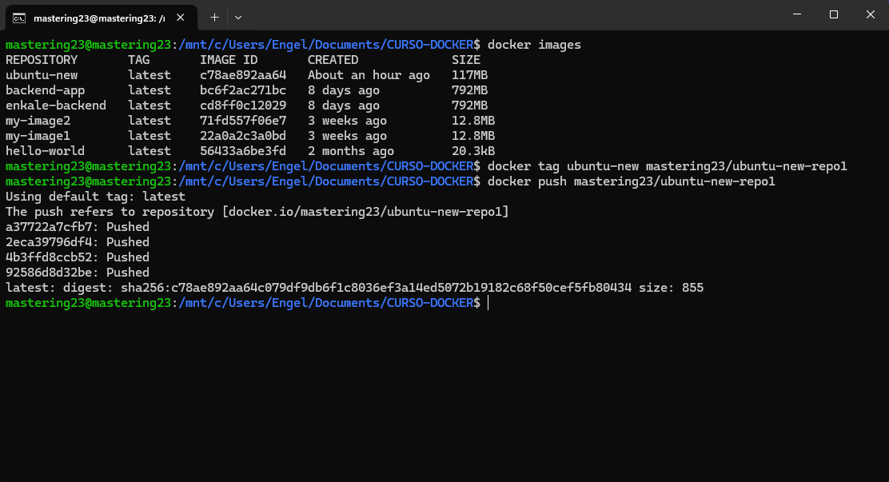

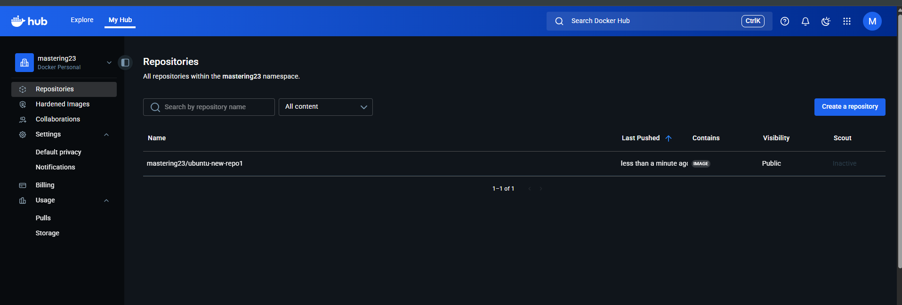


## TEST 5 run a simple web page inside a Docker container using Nginx.

#### able to create a dockerfile and myapp.html build and run container @ http://localhost:7070/myapp.html

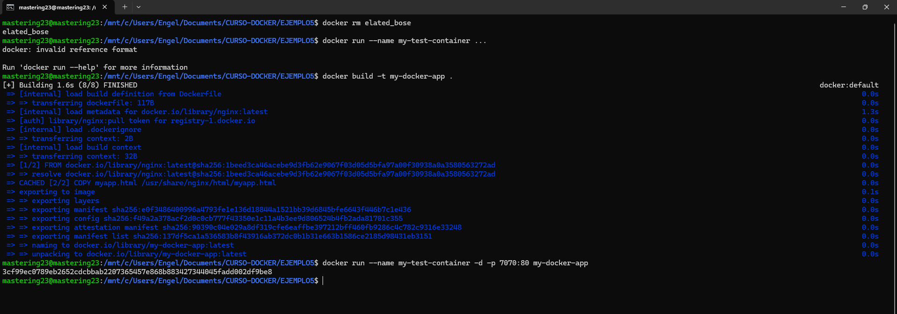


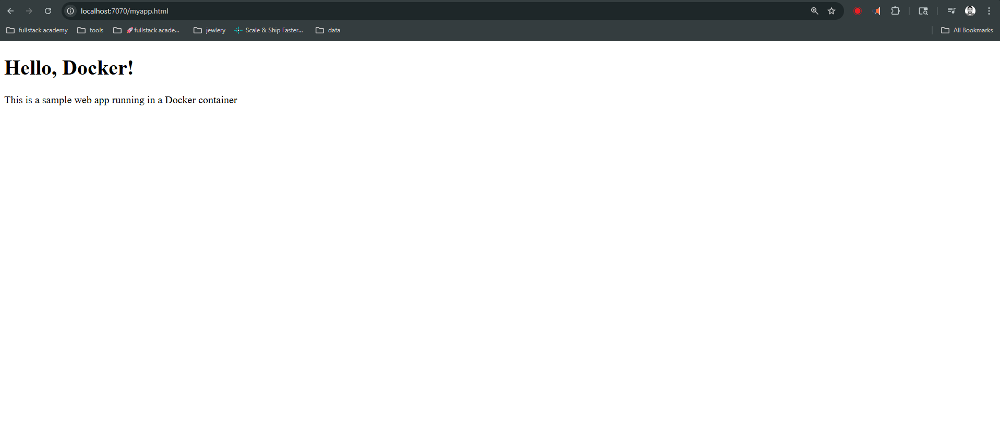


## Docker Networks  | brigde & host

#### <strong> Docker Network </strong> is virtual network that allows Docker containers to communicate with each other and with external systems, while controlling how that communication happens.

#### <strong> Bridge Network </strong> is the dafult network type in Docker.Each container gets its own private IP address and communicates through a virtual bridge created by Docker.
#### <strong> Host Network </strong> removes the network isolation between the container and the Docker host. The container shares the host’s IP address and ports, so there is no need for port. mapping.


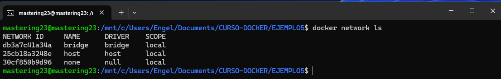

```bash 
# command to shows networks listed 
docker network ls 
```

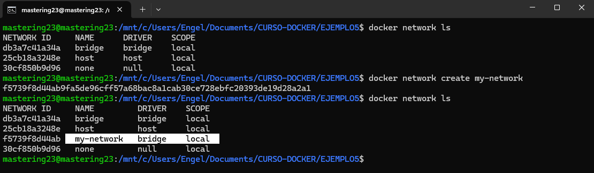

```bash 
# command to create a network 
# networkName in this case is my-network
docker network create + networkName
```

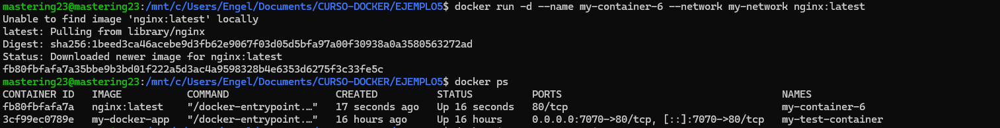
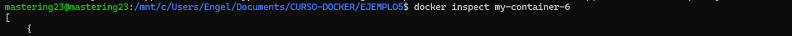
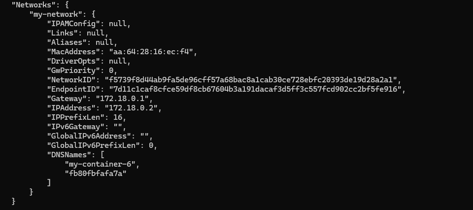

```bash 
docker run -d --name my-container-6 --network my-network nginx:latest
# Part	What it does
# docker run	Creates and runs a new container from an image.
# -d	Runs the container in detached mode, meaning it runs in the background.
# --name my-container-6	Assigns a custom name to the container (my-container-6).
# --network my-network	Connects the container to the Docker network called my-network. This allows it to communicate with other containers on the same network.
# nginx:latest	Specifies the image to use for creating the container. In this case, the latest version of Nginx.

docker inspect my-container-6
# inspect my-container-6
```

```bash
docker network disconnect my-network my-container-6
#disconnet  cointainer from the network assign in this cases my-network. 
```

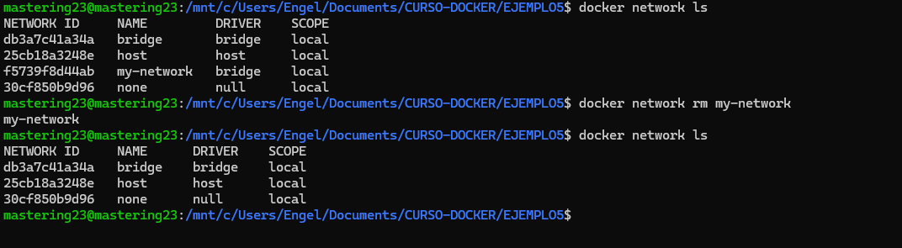

```bash
docker network rm my-network 
# removed network listed. in this case my-network.
```

## Docker Volumes | Bind Mounts

#### <strong> Volumes </strong> is a special storage area managed by Docker, independent of the containers filesystem and can be shared between multiple containers. 


#### <strong> Bind Mounts </strong> is when you mount a specific directory or file from your host machine directly into the container.


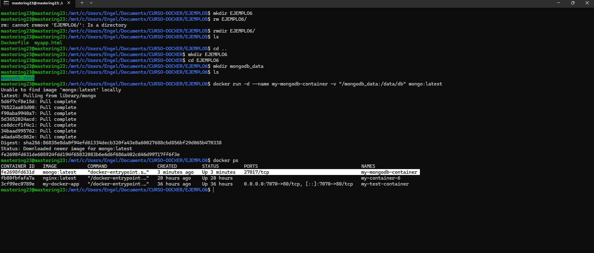

```bash
docker run -d --name my-mongodb-container -v "/mongodb_data:/data/db" mongo:latest  
# Creates a container based on the MongoDB image with a bind mount.
# The bind mount maps the local directory /mongodb_data to /data/db inside the container,
# allowing MongoDB data to persist even if the container is removed.
```


```bash
docker exec -it my-mongodb-container bash  
# Gives you terminal access inside the container to interact with the MongoDB environment.

# Start the MongoDB shell inside the container
mongosh  
# Opens the MongoDB interactive shell to run database commands.

# Switch to (or create) a database named 'dbtest'
use dbtest  

# Insert new user documents into the 'users' collection
db.users.insert({"name":"Mark Ten"})  
db.users.insert({"name":"Jasmin Smith"})  
db.users.insert({"name":"Peter Scale"})  
# Adds three new user records to the database.

# Display all user records from the 'users' collection
db.users.find()  
# Shows the inserted documents in JSON-like format.

```

